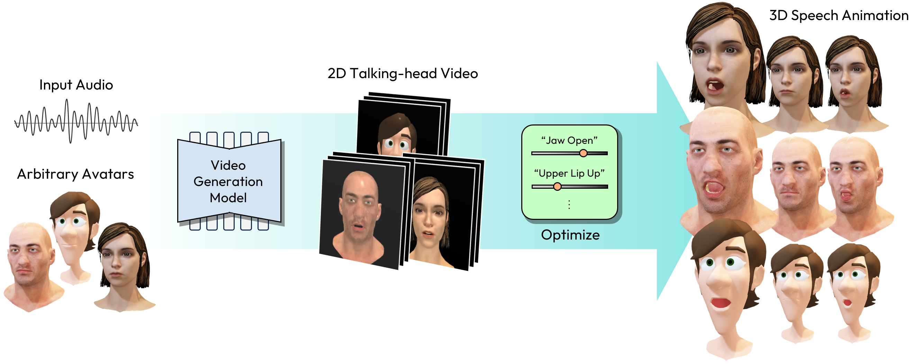
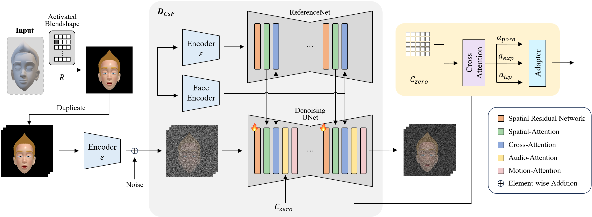

# AnyTalk — Character-specific Fine-tuning



**Bring an arbitrary 3D character to life from speech—without collecting an
animated character dataset.**

This repository contains the Character-specific Fine-tuning (CsF) and temporal
inference code from *AnyTalk: Speech Animation for Arbitrary Characters
Leveraging a Video Generation Model*. CsF adapts the spatial appearance prior of
[Hallo](https://github.com/fudan-generative-vision/hallo) from static
blendshape renders while preserving its pretrained audio and temporal motion
priors.

## Highlights

- Character adaptation from frontal, single-blendshape renders
- No target-character animation sequence required
- Speech-driven temporal generation with separate pose, expression, and lip controls
- Compact release containing only the training, preprocessing, and inference code



## Setup

The tested environment uses Python 3.10 and CUDA 12.1.

```bash
conda create -n anytalk-csf python=3.10
conda activate anytalk-csf
pip install -r requirements.txt
pip install -e .
sudo apt-get install ffmpeg libgl1
```

Download the [Hallo weights](https://huggingface.co/fudan-generative-ai/hallo)
and arrange them as follows:

```text
pretrained_models/
├── audio_separator/Kim_Vocal_2.onnx
├── face_analysis/
├── hallo-net/net.pth
├── motion_module/mm_sd_v15_v2.ckpt
├── sd-vae-ft-mse/
├── stable-diffusion-v1-5/
└── wav2vec/wav2vec2-base-960h/
```

## Run CsF

### 1. Prepare static temporal data

Render one frontal image per blendshape, then convert and preprocess the renders:

```bash
python scripts/create_static_videos.py \
  --input-dir /path/to/blendshape_renders \
  --output-dir data/target_character/videos

python -m scripts.data_preprocess \
  --input_dir data/target_character/videos --step 1
python -m scripts.data_preprocess \
  --input_dir data/target_character/videos --step 2
python scripts/extract_meta_info_stage2.py \
  --root_path data/target_character --dataset_name target_character
```

### 2. Fine-tune the character

Update character paths in `configs/train/csf.yaml`, then run:

```bash
accelerate launch --config_file accelerate_config.yaml \
  scripts/train_csf.py --config configs/train/csf.yaml
```

Checkpoints are written to
`outputs/csf/target_character/modules/net-{step}.pth`.

### 3. Animate from speech

```bash
python scripts/inference.py \
  --source_image /path/to/reference.png \
  --driving_audio /path/to/speech.wav \
  --net_dir outputs/csf/target_character/modules/net-100.pth \
  --output outputs/inference/result.mp4
```

The AnyTalk defaults use pose `0`, expression `1`, and lip `2`. Use
`--pose_weight`, `--face_weight`, and `--lip_weight` to adjust them.

## Notes

Data, renders, generated videos, pretrained models, and checkpoints are not
included in this repository.

This implementation is derived from Hallo and AnyMoLe. See [LICENSE](LICENSE)
and [NOTICE](NOTICE) for details.
